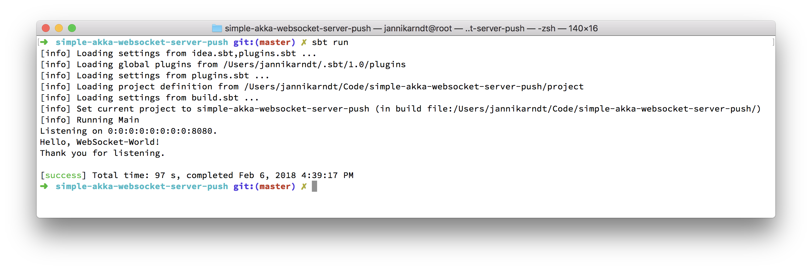
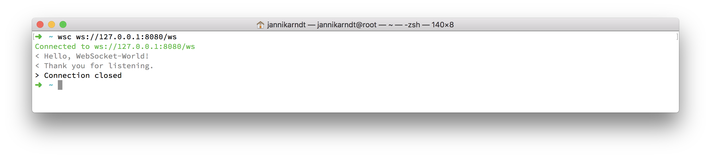

# Server-Push Websocket with Akka HTTP

This is a minimal example for a websocket that pushes events to a client.

Start by running sbt:

```bash
$ sbt run
...
[info] Running Main 
Listening on 0:0:0:0:0:0:0:0:8080.

```

Now, start a websocket-client, for example [wsc](https://github.com/danielstjules/wsc):

```bash
$ wsc ws://127.0.0.1:8080/ws
Connected to ws://127.0.0.1:8080/ws
```

You can now start typing in the (first) console and receive messages in the second one:




Input an empty line to quit.


### The Code

The code consists of two objects:

* `Main` creates the `/ws` route, binds it to `WebSocket.listen()`, starts the server and listens on StdIn for messages to send to `Websocket.sendText()`.
* `WebSocket` provides a `listen` function to register a new listener (or `browserConnection`) and a `sendText` function to send a message to every registered connection.
The trick here is, that `browserConnection` stores a list of _functions_ that can be called later. These functions are the [`offer`](https://github.com/akka/akka/blob/master/akka-stream/src/main/scala/akka/stream/scaladsl/Queue.scala#L30) functions on a `Queue` that sends them to the websocket.